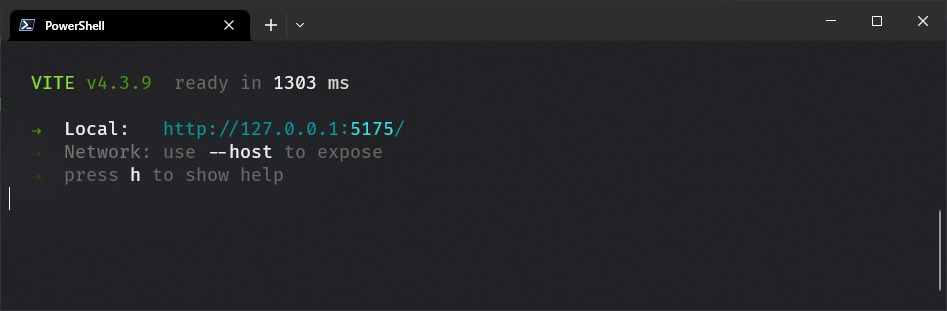

# Challenge

# Memory game

---

This challenge was made using React.js and Tailwind css only. The game consists of guessing the position of 4 pairs of cards before the time is up.

# Demo

---

Live demo: [Memory game](https://memory-game-e3b6b.web.app).

To build this repo locally with yarn, run:

```jsx
yarn install
yarn run dev
```

Then your terminal will show your local adress.



